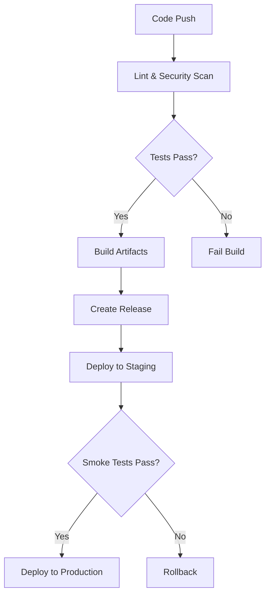
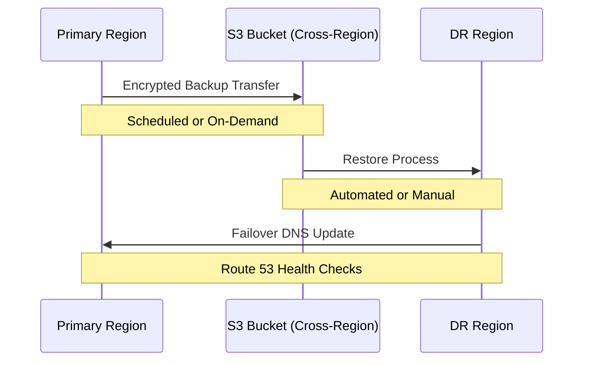

# DevOps Projects


## 🔍 Overview

This repository showcases enterprise-grade DevOps implementations across the full spectrum of modern infrastructure and deployment practices. Each project demonstrates production-ready approaches to automation, security, and operational excellence.

## 📋 Featured Projects

### 1. Infrastructure as Code (IaC)

Reproducible AWS infrastructure using Terraform with state management and modular design patterns.

#### Key Features

- **Multi-Environment Deployments**: Production, Staging, and Development environments with shared modules
- **State Management**: Remote state stored in S3 with DynamoDB locking
- **Secret Handling**: Integration with AWS Secrets Manager and KMS for secure credential management
- **Compliance Controls**: Infrastructure defined with security best practices and compliance requirements

```hcl
module "networking" {
  source = "./modules/networking"

  vpc_cidr        = var.vpc_cidr
  subnet_count    = var.subnet_count
  environment     = var.environment
  resource_tags   = local.common_tags
}
```

### 2. CI/CD Pipelines

GitOps-driven release processes implemented with GitHub Actions, enabling automated testing, building, and deployment.

#### Pipeline Architecture



#### Implemented Workflows

| Pipeline          | Trigger         | Actions                                 | Targets          |
| ----------------- | --------------- | --------------------------------------- | ---------------- |
| **CI Build**      | Pull Request    | Linting, Unit Tests, Security Scans     | N/A              |
| **CD Staging**    | Merge to `main` | Build, Package, Deploy                  | Staging EKS      |
| **CD Production** | Release Tag     | Validation, Deploy                      | Production EKS   |
| **Nightly Scans** | Scheduled       | Dependency Updates, Vulnerability Scans | All Repositories |

### 3. Containerization

Enterprise container strategy using Docker with migration from Alpine to Universal Base Images (UBI) for enhanced security.

#### Image Security Features

- **Software Bill of Materials (SBOM)** generation and attestation
- **Image Provenance** via Sigstore/Cosign
- **Layer Optimization** for smaller attack surface
- **Multi-stage Builds** for minimal runtime dependencies

```Dockerfile
# Build stage
FROM registry.access.redhat.com/ubi8/go-toolset:1.17 as builder
WORKDIR /app
COPY . .
RUN go build -o app main.go

# Runtime stage
FROM registry.access.redhat.com/ubi8-minimal:8.5
WORKDIR /app
COPY --from=builder /app/app .
USER 1001
ENTRYPOINT ["./app"]
```

### 4. Configuration Management

Ansible roles executed at pod startup for consistent configuration across environments.

#### Configuration Structure

- **Base Roles**: Applied to all environments
- **Environment-Specific Roles**: Customized for prod/staging/dev
- **Application-Specific Roles**: Service-targeted configurations

```yaml
# Example Ansible Role Structure
roles/
├── base/
│   ├── system_hardening/
│   ├── monitoring_agent/
│   └── logging/
├── environments/
│   ├── production/
│   ├── staging/
│   └── development/
└── applications/
├── api_service/
├── database/
└── cache/
```

### 5. Kubernetes Operations

Zero-downtime deployment strategies on Amazon EKS with advanced rollout controls.

#### Kubernetes Architecture


#### Deployment Strategies

- **Rolling Updates** with configurable surge and unavailability parameters
- **Blue/Green Deployments** for critical services
- **Canary Releases** with traffic shaping
- **Feature Flagging** integration for controlled feature rollouts

```yaml
# Example Kubernetes Deployment
apiVersion: apps/v1
kind: Deployment
metadata:
  name: api-service
spec:
  replicas: 3
  strategy:
    type: RollingUpdate
    rollingUpdate:
      maxSurge: 1
      maxUnavailable: 0
  template:
    spec:
      containers:
        - name: api
          image: ${ECR_REPO}/api:${VERSION}
          readinessProbe:
            httpGet:
              path: /health
              port: 8080
```

### 6. Data Resilience

Comprehensive backup and recovery solutions for AWS-managed database services.

#### Supported Database Services

| Service         | Backup Method          | Recovery Time Objective | Recovery Point Objective |
| --------------- | ---------------------- | ----------------------- | ------------------------ |
| **RDS**         | Automated Snapshots    | < 30 minutes            | 5 minutes                |
| **Aurora**      | Continuous Backup      | < 15 minutes            | < 1 minute               |
| **DynamoDB**    | Point-in-time Recovery | < 1 hour                | 5 minutes                |
| **ElastiCache** | Redis AOF + Snapshots  | < 15 minutes            | 1 minute                 |
| **DocumentDB**  | Automated Snapshots    | < 30 minutes            | 1 hour                   |

#### Cross-Region Recovery Strategy



## 🛠️ Technologies Used

- **Cloud**: AWS (EKS, EC2, RDS, S3, DynamoDB, ElastiCache, DocumentDB)
- **IaC**: Terraform, CloudFormation
- **CI/CD**: GitHub Actions, Jenkins
- **Containers**: Docker, Kubernetes
- **Configuration**: Ansible, Helm
- **Monitoring**: Prometheus, Grafana, ELK Stack
- **Security**: SAST/DAST, Container Scanning, Secret Detection

## 📚 Project Structure

```
devops-portfolio/
├── terraform/                # Infrastructure as Code
│   ├── modules/              # Reusable Terraform modules
│   ├── environments/         # Environment-specific configurations
│   └── scripts/              # Helper scripts
├── pipelines/                # CI/CD pipeline definitions
│   ├── .github/workflows/    # GitHub Actions workflows
│   └── templates/            # Reusable pipeline templates
├── containers/               # Container definitions
│   ├── applications/         # Application Dockerfiles
│   └── base-images/          # Custom base images
├── ansible/                  # Configuration management
│   ├── roles/                # Ansible roles
│   └── playbooks/            # Playbooks for different scenarios
├── kubernetes/               # Kubernetes manifests
│   ├── base/                 # Base configurations
│   ├── overlays/             # Kustomize overlays
│   └── helm-charts/          # Helm charts
└── backup-restore/           # Data resilience solutions
    ├── scripts/              # Backup and restore scripts
    └── configs/              # Configuration files
```

## 🚀 Getting Started

### Prerequisites

- AWS CLI configured with appropriate permissions
- Terraform >= 1.0.0
- kubectl configured to access your Kubernetes cluster
- Docker installed for local container building
- Ansible >= 2.9

### Setup Instructions

1. Clone this repository
2. Navigate to the desired component directory
3. Follow the README.md in each component directory for specific instructions

## 📊 Results and Impact

- **Deployment Frequency**: Increased from bi-weekly to multiple times daily
- **Lead Time**: Reduced from days to hours
- **Change Failure Rate**: Decreased by 65%
- **Recovery Time**: Improved from hours to minutes
- **Infrastructure Costs**: Optimized by 30% through automated scaling and resource management

## 📝 License

This project is licensed under the MIT License - see the LICENSE file for details.
